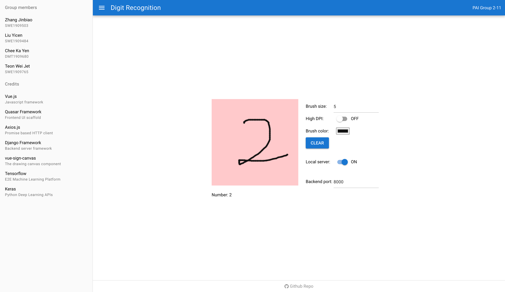
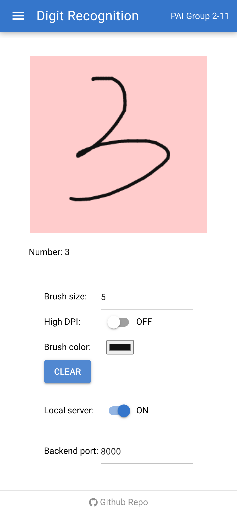
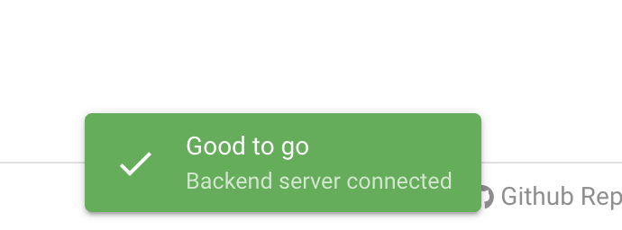
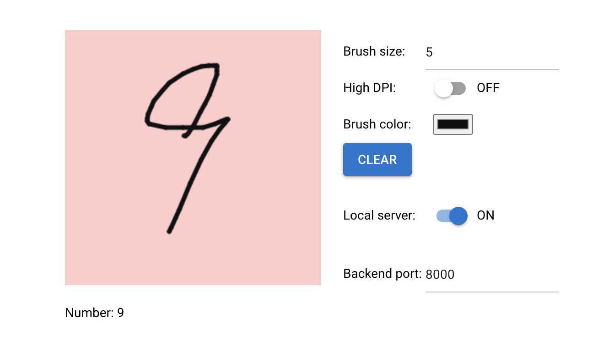
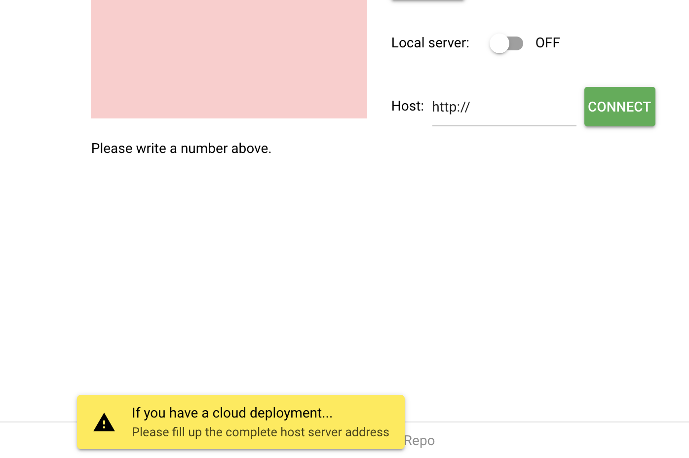

# SOF106-Project
SOF106 PAI Final Project GitHub repository

Topic: `Handwritten digit recognition`

## Screenshot

PC (big screen):

<a href="screenshot/pc.png" target="_blank"></a>

Mobile:




## Get started

This project takes the idea of separating backend and frontend. The frontend a vue-based project run with Node(>=10.18.1, details in package.json). The backend is tasked with the data processing and Machine Learning model building (made possible with TensorFlow and MNIST handwritten digit database).

### Start the frontend server

> Do Not use Safari to access the frontend server, it will reject the requests to LOCAL backend server since its HTTP(without S) connection. If you deploy the backend with a SSL certificate, ignore this note.

>  You can always **use our pre-deployed frontend server [here](https://sof-106-project-frontend.vercel.app/)** (Vercel) and skip to backend server section.

Make sure you have installed Node(>=10.18.1) on your machine.

In the frontend root `/frontend` ,

```shell
# install dependencies
yarn
# or `npm install`
```

When the dependencies are installed,

```shell
# start the local dev server
yarn dev
# or `npm run dev`
```

Check outputs, it will open `http://127.0.0.1:8080/` in your browser by default.

### Start the backend server

> By the constraints of [slug-size](https://devcenter.heroku.com/articles/slug-compiler#build-cache) on Heroku, we did not deploy a backend on cloud for use, you can download the source code in `/backend` and execute the following instructions.

The data exchange between backend and frontend is handled by Django Framework. (Based on Python 3.8, make sure you have it installed.)

In the backend root `/backend`, install the packages:

```shell
# install packages
pip install -r requirements.txt
```

When it prompts done,

```shell
python manage.py runserver
```

Check the outputs, It will start the backend server at `http://127.0.0.1:8000/` by default.

## Usage

If you correctly configure as mentioned above, you will see `Good to go` prompt when you open the frontend server in your browser.



Write the digit on the pink-colored canvas, you will get the result shortly.




If you have a different local server port than `8000` , set it on the interface.

### Use cloud backend

If you have a cloud server for backend, toggle the Local server OFF and type the **full address** for your server and click CONNECT button, e.g. `http://your.cloud-server.com:8000`



### Options

As shown on the interface, there are some options for adjustment:

- Brush size: The size of brush
- High DPI: If your device has a high dpi then can toggle it to upload a more clear digit image
- Brush color: The color of brush
- Local server: Cloud deployment and local port settings as mentioned above.

## Credits

This project is made possible with these open-source projects:

- Vue.js
- Quasar Framework
- Axios.js
- Vue-sign-canvas
- Django Framework
- Tensorflow
- Keras
